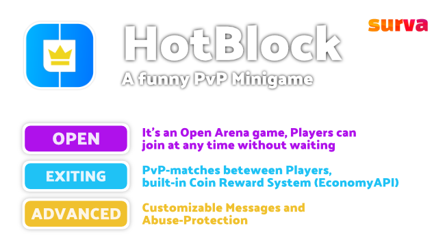

    

<h1 align="center">HotBlock</h1>

A funny PvP Minigame

 

    
    
    
    
    
    

##

    

✅ Ready for PocketMine-MP version 4.0 (PM4).

[• Description](#-description)  
[• Features](#-features)  
[• Usage](#-usage)  
[• Example Game Arena](#-example-game-arena)  
[• Contribution](#-contribution)  
[• License](#%EF%B8%8F-license)

## 📙 Description
HotBlock is a funny PvP mini-game.
The goal is to stand as long as possible on the 'Hot Block' in the middle of the arena in order to earn money (using a supported economy plugin).
Because every player wants to get there, there is an exiting PvP-match. The dangerous poisoned blocks are making the game even more exiting.

## 🎁 Features
- **OPEN ARENA** Open Game Arena where players can join at any time
- **EXITING MATCHES** Exiting PvP-matches for the players
- **ADVANCED FEATURES** Customizable Messages and Abuse-Protection

## 🖱 Usage
There are different types of blocks in the game arena:

| Block        | PvP | Effect                                                                            |
|--------------|-----|-----------------------------------------------------------------------------------|
| `WOOD`       | ❌   | All players are safe, usually they spawn there                                    |
| `ENDSTONE`   | ✅   | Normal playing field, nothing special here                                        |
| `NETHERRACK` | ✅   | Players get poisoned for 2-3 seconds when walking over those blocks               |
| `QUARTBLOCK` | ✅   | The HotBlock, players are earning some coins per second when moving on this block |

### 🕹 Example Game Arena
This is how a HotBlock world could look like ([download the example world here](https://static.surva.net/osplugins/hotblock/HotBlock_example_world.zip)):

[Read the full documentation 📖](https://plugins.surva.net/docs/HotBlock) • [Ask questions on Discord 💬](https://discord.gg/t4Kg4j3829)

## 🙋‍ Contribution
Feel free to contribute if you have ideas or found an issue.

You can:
- [open an issue](https://github.com/survanetwork/HotBlock/issues) (problems, bugs or feature requests)
- [create a pull request](https://github.com/survanetwork/HotBlock/pulls) (code contributions like fixed bugs or added features)
- [help translating the plugin](https://www.transifex.com/surva/hotblock) (help us to translate this plugin into your language on Transifex platform)

Please read our **[Contribution Guidelines](CONTRIBUTING.md)** before creating an issue or submitting a pull request.

Many thanks for their support to all contributors!

## 👨‍⚖️ License
[MIT](https://github.com/survanetwork/HotBlock/blob/master/LICENSE)
